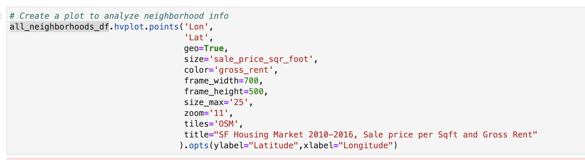

# SF_Housing_Analysis
This project showcases using data visualization, aggregation, interactive visualizations, and geospatial analysis, to identify properties in the San Francisco market that are viable investment opportunities.

This program is a protype for demonstration purposes that utilizes pandas data analysis and visualiztions, as well as a Monte Carlo Simultion to evaluate the expected performance of financial holdings over the next 10-30 years.

---

## Technologies

Python implementation: CPython

Python version       : 3.7.13

IPython version      : 7.31.1

---

## Packages & Libraries

Pandas

hvplot from pandas

from pathlib import Path

watermark

---

## Importing and Aggrigating Data
The data used in this analysis is from the csv file "sfo_neighborhoods_census_data.csv".  Data is imported using the Path module then converted into a dataframe using pandas.

---

## Aggrigating and Analyzing the Data

*Trend in SF Housing Units from 2010-2016*

Grouping the housing units by year data allows for agrigation and easy visualization of the trend in SF housing trends over the period of 2010-2016. Based on this dataset, the bar chart clearly shows the increase in SF housing units in SF during the 6 year period.

`# Create a numerical aggregation that groups the data by the year and then averages the results.`
`housing_units_by_year = sfo_data_df.groupby("year").mean()`

`housing_units_by_year.hvplot.bar(legend= "top", height=300, width=600, x="year", y="housing_units", title="Housing Units in SF from 2010-2016"
                                ).opts(xlabel="Year", ylabel="Housing Units", yformatter="%.0f", ylim=(360000,390000))`
                                

*Trend in SF Housing Sale Price per square foot (sqft) and Gross Rent from 2010-2016*

This section uses numerical and visual aggregation of specific data in the cvs file to calculate the average prices per square foot, and average gross rent per year, for each year of the 6 year period.  The results are listed in a dataframe.

`# Create a numerical aggregation by grouping the data by year and averaging the results`
`prices_square_foot_by_year = sfo_data_df.groupby("year").mean()`

Pandas hvplot us used to style and plot the data in a bar chart for easy recoginition of the upward trend of both sale price per sqft and rental price, and the dramatic increase in rental price.

`# Plot prices_square_foot_by_year. `
`# Inclued labels for the x- and y-axes, and a title.`
`prices_square_foot_by_year.hvplot.line(title="Sale Price per SqFt and Gross Rent price from 2010-2018 in SF").opts(
    yformatter="%.0f", xlabel="Year", ylabel="Price in USD $")`
    

*Trend in SF Housing Price per Neighborhood from 2010-2016*

In this section an interactive visualization is created with hvplot to use widgets allowing the user to explore the average sale price per square foot by neighborhood.

The original dataframe is refigured to include group the data by year and by neighborhood to find the mean sale price per sqft and the mean gross rentbefore being plotted.

`# Group by year and neighborhood and then create a new dataframe of the mean values`
`prices_by_year_by_neighborhood = sfo_data_df.groupby(['year', 'neighborhood']).mean()`

`# Use hvplot to create an interactive line plot of the average price per square foot`
`prices_by_year_by_neighborhood.hvplot(x='year', groupby='neighborhood').opts(xlabel='Year', ylabel='Price in USD', title='Sale Price by Sqft, and Gross Rent, 2010-2016, by SF Neighborhood')`

*Interactive SF Housing Neighborhood Map from 2010-2016*

In this section an interactive visualization map is created using latitude/longitude data from the csv file "neighborhoods_coordinates.csv", located in the Resources folder.  Geoviews is used to plot points based on size = the gross rent per data point, and the color identifies the variation in sale price per square foot.

The original dataframe on SF housing is modified to concatinate with the csv containing the latitude and longitude per neighborhood so the two can be concatonated.  

`all_neighborhoods_df = pd.concat(
    [neighborhood_locations_df, all_neighborhood_info_df], 
    axis="columns",
    sort=False,
)`

The resulting dataframe all_neighborhoods_df. it used to map all the data using the following code.

## Final Analysis

Based on all the anylsis in this project, the San Francisco real estate market looks like a solid bet for the one click buy and rent market.  More in-depth research could be done from this first assessment to see which neighborhoods would have the highest ROI.
